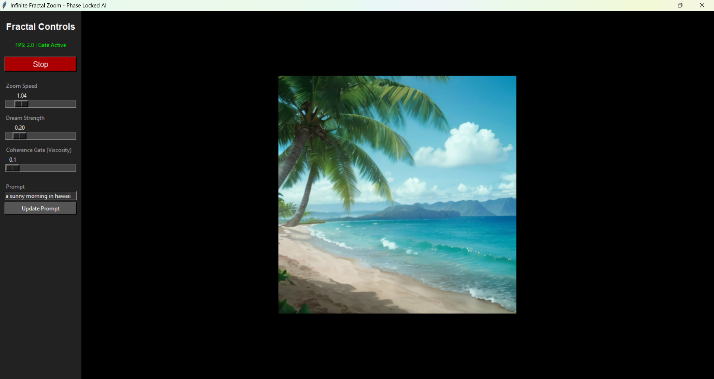

# InfiniteZoomFlow (Matrix Beta): Phase-Locked Fractal AI 🌀

# EDIT: Added matrix alpha that: #

## Matrix Alpha: Inter-Model Communication for Stable Generative AI

Matrix Alpha is an experimental architecture demonstrating that multiple AI models can communicate through shared embedding space rather than through the bottleneck of human-readable text. The system combines a Vision Brain (CLIP), a Memory Brain (temporal embedding buffer), and a Motor Brain (Stable Diffusion) into a unified generative system that maintains semantic coherence across continuous generation.

The core problem Matrix Alpha solves is **semantic drift**. Traditional generative systems like Deforum or standard img2img pipelines treat each frame independently. The diffusion model receives pixels and a text prompt, but has no understanding of what those pixels *mean* or what they *were* in previous frames. A palm tree can morph into coral, then machinery, then abstract noise - because the generator is blind to semantics.

Matrix Alpha introduces **semantic steering** through inter-model communication. Before each generation step, CLIP analyzes the current frame and produces a 768-dimensional embedding representing "what this scene IS." This isn't a text description - it's the actual geometric representation of meaning that both CLIP and Stable Diffusion share by architectural inheritance. SD1.5 was trained with CLIP conditioning, meaning these models already speak the same language.

The system then analyzes void boundaries - regions where structure meets empty space (typically created by zoom operations). By encoding patches from these transition zones, the system understands "what should continue into the voids." If a tree trunk borders empty space, the boundary embedding carries that semantic information forward.

A temporal memory buffer maintains rolling averages of recent scene embeddings, providing resistance to sudden semantic shifts. The world "remembers" what it has been, creating gravitational pull toward consistency.

These four signals - scene understanding, boundary context, temporal memory, and user prompt - blend in embedding space before conditioning the diffusion model. The result: instead of receiving "forest scene" (generic), the generator receives a semantically grounded vector encoding "THIS specific forest, continue THESE specific trees, maintain THIS specific atmosphere."

The Fractal Viscosity system provides spatial gating, determining *where* the AI should dream (low-structure regions) versus *where* it should preserve (high-structure regions). Combined with semantic steering that determines *what* to dream, the system achieves both spatial and semantic coherence.

# Rest of the repo: 



EDIT added Matrixvision.py - it uses different image model and is coded a bit different, but still uses 
the same ideas. The image model can go black due to nsfw found in the generated image. If that happens 
lift the dream strength and jump through darkness. 


> **"Not a Blind Painter, but a Lucid Dreamer."**

InfiniteZoomFlow is a real-time, physics-gated generative AI system. Unlike traditional zoomers (like Deforum) that blindly hallucinate over moving pixels, this system uses **Fractal Viscosity** to distinguish between solid objects and empty space.

It locks coherent structures in place while allowing the AI to "dream" only into the voids, creating permanent, navigable worlds rather than fever dreams.

## 🚀 Key Features

* **Fractal Viscosity Gating:** A physics-based mask that prevents the AI from overwriting high-complexity textures (objects/roots/faces).
* **Infinite Zoom Engine:** Continuous affine feedback loop with sub-pixel precision.
* **Steerable Camera:** Use your mouse to fly through the generated latent space in real-time.
* **LCM Acceleration:** Uses Latent Consistency Models (SD 1.5) for high-speed (15-30 FPS) inference on consumer hardware.
* **Phase Locking:** Maintains structural integrity of the world as you fly past it.

## 🛠️ Installation

### Prerequisites
* Python 3.10 or higher
* NVIDIA GPU with 6GB+ VRAM (Recommended)

### Setup
1.  **Clone the repository:**
    ```bash
      git clone https://github.com/anttiluode/MatrixBeta.git
      cd MatrixBeta
    ```

2.  **Install Dependencies:**
    ```bash
    pip install -r requirements.txt
    ```
    *(Note: For best performance, ensure you have PyTorch installed with CUDA support).*

3.  **Run the Engine:**
    ```bash
    python InfiniteZoomFlow2.py
    ```

## 🎮 Controls

* **Mouse:** Move cursor relative to the center of the window to steer the zoom direction.
* **Zoom Speed:** Controls how fast you dive into the fractal.
* **Dream Strength:** How much "new" content the AI generates per frame.
* **Coherence Gate (Viscosity):**
    * **Low (0.5):** Dreamy, fluid world. Objects morph frequently.
    * **High (1.5):** Rigid, physical world. Objects persist, only empty space is filled.

## 🧠 The Science: Why This Works

Traditional AI video generators suffer from "hallucination flicker" because they treat every pixel as equal. This system implements a **Physical Cortex** layer:

1.  **The Zoom:** The previous frame is scaled and warped to match the camera movement.
2.  **The Measurement:** The system calculates the **Fractal Dimension** (β) of every region in the image.
    * *High Complexity (High β)* = "Matter" (Don't touch).
    * *Low Complexity (Low β)* = "Void" (Generate here).
3.  **The Lock:** A spatial mask protects the "Matter" from the diffusion process.
4.  **The Dream:** The AI runs a denoising step *only* on the "Void" regions, seamlessly blending new details into the existing reality.

## 📜 License
MIT License. Feel free to modify and distribute.
